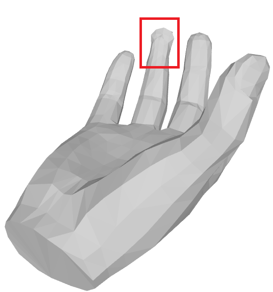

## Simulating soft-tissue deformation in hand interacting with objects.

This implementation follows the methods laid out in the paper titled [HMDO : Markerless multi-view hand manipulation capture with deformable objects](https://www.sciencedirect.com/science/article/pii/S1524070323000085).

Vertcies of hand mesh penetrating the object mesh are first detected and taken as trainable parameters.
Using losses based on extent of penetration and losses meant to regularize, location of hand vertices penetrating the object is adjusted with gradient descent.
The iterative optimization steps result in penetration being reduced, hand vertices being displaced out of the object, simulating pressing of the muscles against object surface, i.e., soft tissue deformation.

Here's an example scene of a hand interacting with an object:


The image of the hand before the optimization is applied:


The image of the hand after the optimization is applied:


Here's how to run the simulation tool (some sample meshes have been given to try out):

```bash
python soft_body_deform_optimize.py --with_diffuse False --apply_laplacian True --scene {scene_name} --exp {experiment_name} --hand_path sample_meshes/sample_hand_1.obj --obj_path sample_meshes/sample_obj_1.obj --visualize True
```
**with_diffuse**: if True, applies deformation to hand vertices surrounding the penetrating vertices.<br>
**apply_laplacian**: if True, applies laplacian smoothing to the deformed hand mesh.<br>
**scene**: a scene name of choice.<br>
**exp**: an experiment name of choice.<br>
**hand_path**: path to hand mesh ".obj" file.<br>
**obj_path**: path to hand mesh ".obj" file.<br>
**visualize**: if True, visualizes the scene (object and hand mesh) before and after the optimization steps.

Here's how to visualize the resulting meshes from optimization:

```bash
python soft_body_visualize.py --output_path path/to/mesh/results/folder --iteration 3
```
**output_path**: path to mesh output folder.<br>
**iteration**: mesh output iteration to be viewed.